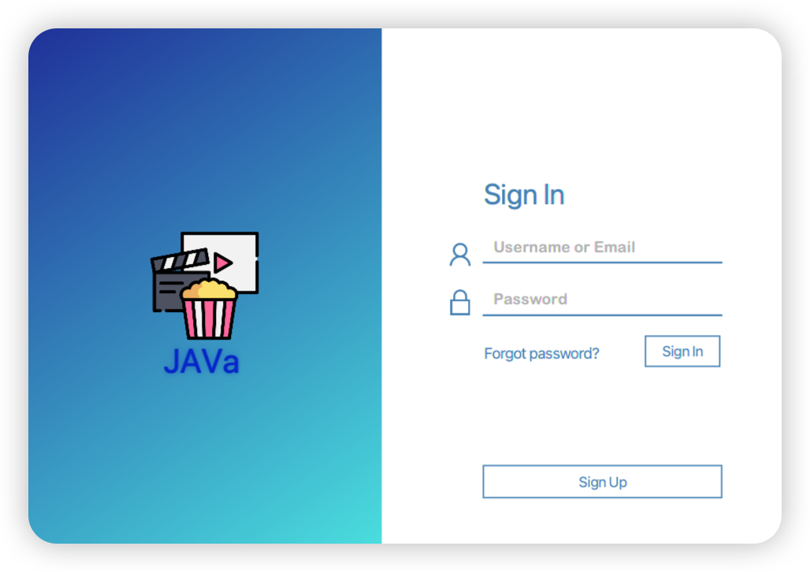
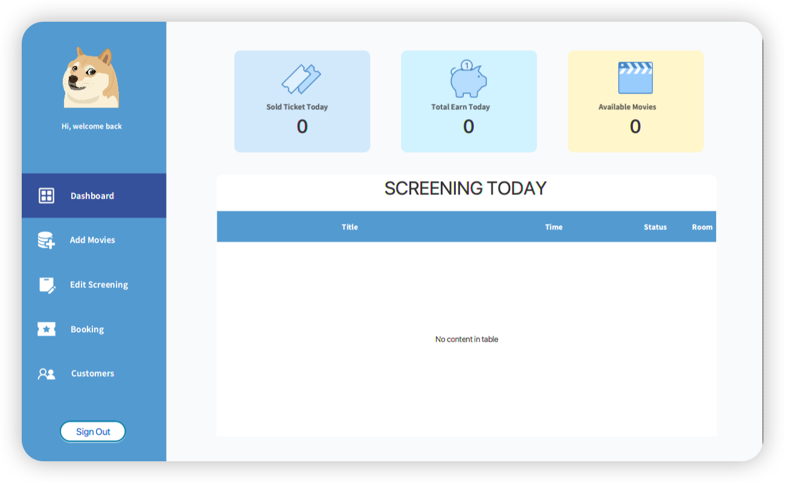
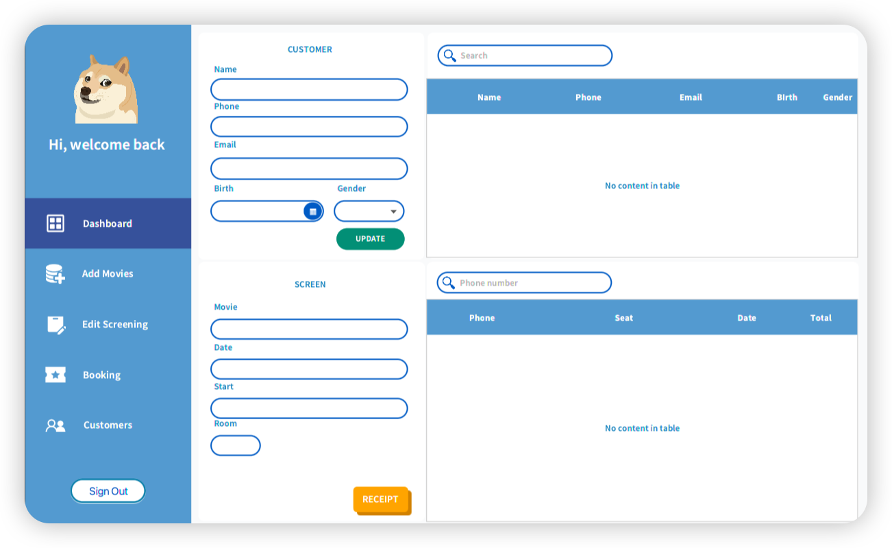

# Basic Ticket Booking Java App

## Overview

This is a project in our course "IS216" - Java programming at UIT. With the particitipating of:

| StudentNo | Full name      |
| --------- | -------------- |
| 21521930  | Đào Tiến Đạt   |
| 21520673  | Phan Chí Cường |

Thanks Master. Vu Minh Sang for assisting. Our app have following functions:

Support cinemas in managing their profit by showing sales figures

Automate the ticket selling process

Automate the manage film screening process

Manage customer information

## Installation

## Demo

